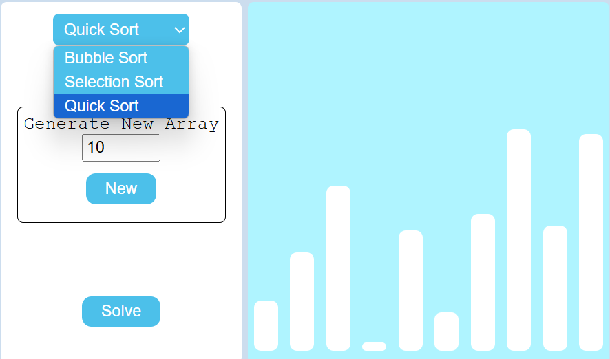
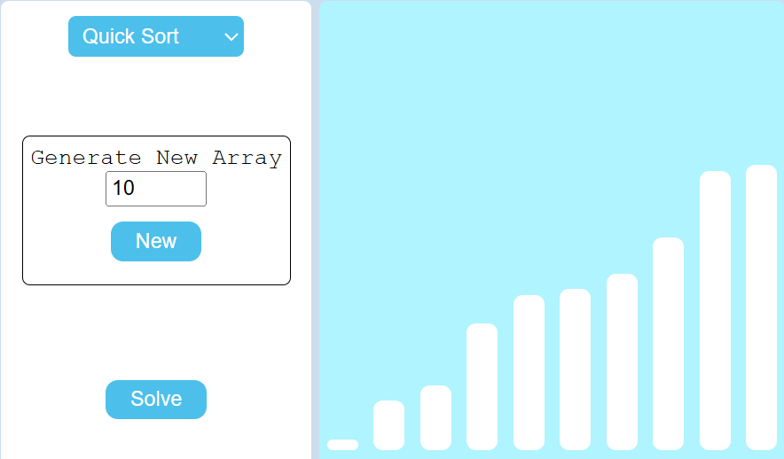

# 🔢 Sorting Visualizer

An interactive web application to visualize popular sorting algorithms in action. Built using **HTML**, **CSS**, and **JavaScript**, this tool helps users understand how sorting algorithms work by providing animated visual feedback.

## 🔗 Live Demo

🌐 [Click here to try it out!](https://priya-sharma06.github.io/Sorting-visualizer/)

---

## 🚀 Features

- 🧠 **Algorithms Supported**:
  - Bubble Sort
  - Selection Sort
  - Quick Sort

- ⚙️ **Interactive Controls**:
  - Dropdown to select the sorting algorithm.
  - Input box to define the number of array elements.
  - "New" button to generate a random array.
  - "Solve" button to visualize the selected sorting algorithm.

- 📊 **Visualization**:
  - Array elements represented as vertical bars.
  - Real-time animations showing comparisons and swaps.
  - Clean and intuitive user interface.

## 🛠️ Tech Stack

- **HTML** – for structuring the UI
- **CSS** – for styling and layout
- **JavaScript** – for algorithm logic and animations

## 📸 Screenshots

### 🎥 Before Sorting


### ✅ After Sorting (Quick Sort Example)


## 🧑‍💻 How to Use

1. Clone this repo:
   ```bash
   git clone https://github.com/your-username/sorting-visualizer.git
   cd sorting-visualizer
2. Open index.html in your browser.
3. Select a sorting algorithm.
4. Enter the number of elements you want to generate.
5. Click New to create a random array.
6. Click Solve to start the animation.

## 🧑‍💻 Future Improvements
1. Add more algorithms (Merge Sort, Heap Sort, Insertion Sort)
2. Add sound effects during sorting
3. Include time and step complexity metrics
4. Mobile responsiveness

